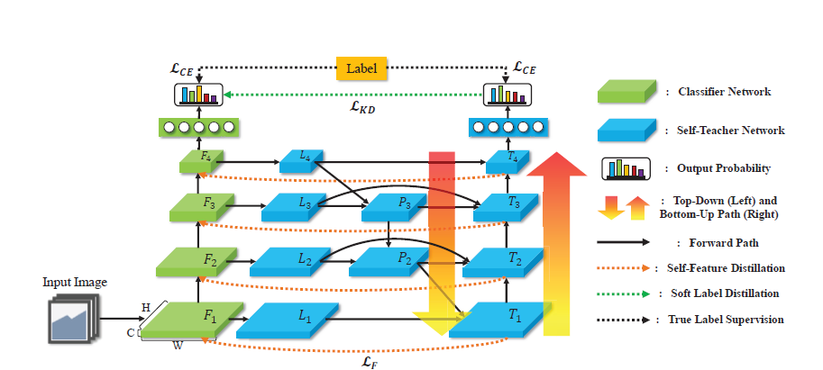

# Recurrent-FRSKD
Pytorch implementation and recurrenting of the paper: ["Refine Myself by Teaching Myself :
Feature Refinement via Self-Knowledge Distillation"](https://openaccess.thecvf.com/content/CVPR2021/papers/Ji_Refine_Myself_by_Teaching_Myself_Feature_Refinement_via_Self-Knowledge_Distillation_CVPR_2021_paper.pdf).

<div align="center">
  
</div>

## :wave:Introduction

This is my big assignment on data mining, which is mainly to complete the algorithm of knowledge distillation. I mainly reproduced a paper from CVPR 2021 to deepen my understanding and knowledge of self-distillation. This big assignment also helped me a lot in my subsequent postgraduate study.

## :page_facing_up: Code Structure

Our main code structure is as follows:

```shell
│  dataset.py
│  inference.py
│  main.py
│  ...
│      
├─distill_loss
│  │  AT.py
│  │  FitNet.py
│  │  ...
│          
├─GUI
│  │  gui.py
│  │  gui.ui
│  │  ...
│  │          
│  ├─models
│  │  │  bifpn.py
│  │  │  bifpnc.py
│  │  │  ...
│          
├─models
│  │  bifpn.py
│  │  bifpnc.py
│  │  ...
        
```

The following is an analysis of the main documents:

1. **dataset.py**:Loading dataset file
2. **main.py**:Main file for training the model
3. **distill_loss**:The loss function of our model
4. **GUI**:The additional GUI we completed was mainly completed using QT
5. **models**:A series of model files

## :fire:Run

Dataset: We mainly conducted related experiments on **Cifar100**, **Cifar10** and **tiny-Imagenet**.

1. train our model,simply run:

   ```shell
   python main.py\
           --model cifarresnet18\
           --data_dir data/ \
           --data TINY \
           --batch_size 64 \
           --alpha 3 \
           --beta  100 \
           --temperature 3 \
           --use_distill True \
           --aux none \
           --aux_lamb 0 \
           --aug none \
           --aug_a 0 \
           --gpu_id 0 \
   ```

   we also provide bash script file, you can also run this command:

   ```shell
   bash train.sh
   ```

2. Run the GUI
   First, you should place the **corresponding model weight file** under the GUI folder. Then you can run the command:

   ```shell
   bash GUI/main.py
   ```

​	The GUI is as follows:

<div align="center">
     
</div>


## :heart: Acknowledgements

Our code is mainly modified on the [FRSKD](https://github.com/MingiJi/FRSKD).

## :smirk: Tips

If you want my big assignment **report** or the **Pre-trained weights**, please contact me at wucunqi2003@126.com.
